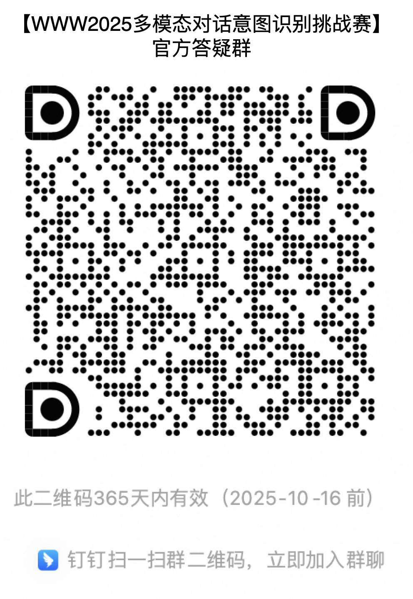

# MIRE

This project provides the baseline for the Multimodal Intent Recognition for Dialogue Systems challenge of  WWW2025 , including functions for model training, evaluation, and converting to submission format.

## How to Use

### **Installation**
This project is based on an open-source training and inference framework; first, you need to **install LLaMA Factory** by referring to 
**https://github.com/hiyouga/LLaMA-Factory**

### Training
**Step 1:** Replace configuration
- Place the downloaded training data file `train.json` into `LLaMA-Factory/data/mire/train.json`
- Replace the data configuration in `mire_baseline/configs/data_info.json` with the original LLaMA-Factory data configuration `LLaMA-Factory/data/data_info.json`
- Place the training configuration file `mire_baseline/configs/qwen2_vl_full_sft.yaml` into `LLaMA-Factory/examples/qwen2_vl_full_sft.yaml`

**Step 2:** Train using the training configuration, performing instruction supervision fine-tuning on a single machine.
```
FORCE_TORCHRUN=1 llamafactory-cli train examples/qwen2_vl_full_sft.yaml
```

### Inference
**Step 1:** Place the inference configuration `mire_baseline/configs/predict.yaml` into `LLaMA-Factory/examples/predict.yaml`, and make sure to update the model address, test data, inference results save address, and other relevant parameters in `predict.yaml`.

**Step 2:** Use the inference configuration to execute the inference command.
```
llamafactory-cli train examples/predict.yaml
```

### Generating Submission File
After modifying the test file and inference result file addresses in `mire_baseline/convert2submit.py`, execute:
```
python mire_baseline/convert2submit.py
```

### Calculating Accuracy (Optional)
If you have labeled test files and corresponding inference results, you can calculate the inference accuracy. Modify the test file and inference result file addresses in `mire_baseline/cal_acc.py` and execute:
```
python mire_baseline/cal_acc.py
```
After running this project, you will see output similar to:
```json
{"f1": 0.5333333333333333, "accuracy": 0.5, "precision": 0.6, "recall": 0.5}
```
Where F1 is the final evaluation metric.

## Task Introduction:
This competition's dataset contains all tasks of classifying text combined with images, including two main categories: image scene classification and multi-turn dialogue intent classification.

### 1) Image Scene Classification:
The specific scene for image scene classification is when users send a picture to customer service, requiring the judgment of what type of e-commerce scene the picture belongs to. The specific category labels and their descriptions are as follows:

| Label                                  | Description                                                  |
| -------------------------------------- | ------------------------------------------------------------ |
| 商品分类选项                           | Product color, specifications options                        |
| 商品头图                               | Main image on the product page                               |
| 商品详情页截图                         | Screenshots that may appear in various sections of the product detail page |
| 下单过程中出现异常（显示购买失败浮窗） | Screenshot of exceptions during the ordering process (showing purchase failed popup) |
| 订单详情页面                           | A page displaying complete order information                 |
| 支付页面                               | Includes payment method selection and payment success page   |
| ~~消费者与客服聊天页面~~                   | ~~Chat pages between the consumer and platform/customer service in apps like Taobao~~ |
| 评论区截图页面                         | Screenshots of the comment area in Taobao or other apps      |
| 物流页面-物流列表页面                  | A page presenting more than two logistic information         |
| 物流页面-物流跟踪页面                  | A page showing the logistics transportation path             |
| 物流页面-物流异常页面                  | A page containing logistics exception information            |
| 退款页面                               | A page that contains refund information                      |
| 退货页面                               | A page that contains return information                      |
| 换货页面                               | A page that contains exchange information                    |
| 购物车页面                             | Images of the shopping cart page in Taobao                   |
| 店铺页面                               | Screenshot of the store's home page                          |
| 活动页面                               | Screenshots of promotions                                    |
| 优惠券领取页面                         | Screenshots of receiving coupons on the store's home page or promotional pages |
| 账单/账户页面                          | Includes transaction details, asset lists, coupon/red envelope lists, etc. |
| ~~个人信息页面~~                           | ~~Various pages related to user personal information~~           |
| 投诉举报页面                           | Complaint or reporting pages                                 |
| 实物拍摄(含售后)                       | Photos taken by users with a camera, including photos after-sales (damages, missing items, discrepancies with description) or other photos taken with a camera |
| 外部APP截图                            | Various screenshots from non-Taobao or Cainiao apps, including Jingdong, Pinduoduo, SMS, mobile system screenshots |
| 平台介入页面                           | Screenshots of platform customer service intervention        |
| 其他类别图片                           | Other images that cannot be determined                       |


### 2) Dialogue Intent Classification
The scene for dialogue intent classification is to determine the user's intent through the dialogue history between the user and customer service, and the current user's question. The dialogue history contains at least one image sent by the user, which may assist in intent judgment. Intent labels and their descriptions are as follows:

| Label          | Description                                                  |
| -------------- | ------------------------------------------------------------ |
| 反馈密封性不好 | Buyer feedback that the product's sealing is poor and will leak |
| 是否好用       | Buyer inquires whether the product is usable                 |
| 是否会生锈     | Inquiry about whether the product will rust                  |
| 排水方式       | Inquiry regarding the drainage methods of products (applicable products: washing machines, water heaters) |
| 包装区别       | Inquiry about the differences in product packaging           |
| 发货数量       | Inquiry about the quantity of products delivered             |
| 反馈用后症状   | Buyer feedback regarding physiological reactions after use   |
| 商品材质       | Inquiry about specific materials of the product and its accessories |
| 功效功能       | Inquiry regarding the efficacy and function of the product   |
| 是否易褪色     | Inquiry about whether the product fades easily               |
| 适用季节       | Inquiry about the applicable season for the product          |
| 能否调光       | Inquiry whether the light source can be adjusted             |
| 版本款型区别   | Inquiry regarding the differences between two versions/models/styles/packages, etc. (excluding differences in quantity/weight/dimensions) |
| 单品推荐       | Consumer inquiry for recommendations on a particular category/item, not at SKU level |
| 用法用量       | Inquiry regarding the methods/steps/sequences for using the product, including but not limited to amount, time, and usage area |
| 控制方式       | Inquiry on how to control the product, whether it can be controlled via mobile/computer |
| 上市时间       | Inquiry regarding the release date of the product            |
| 商品规格       | Inquiry regarding product quantity, weight, content, and capacity |
| 信号情况       | Inquiry about the quality of signals for mobile use, and how to handle poor signals |
| 养护方法       | Inquiry about maintenance methods for the product            |
| 套装推荐       | Consumer inquiry for recommendations on certain sets         |
| 何时上货       | Inquiry regarding restocking/delivery times                  |
| 气泡           | Inquiry on how to avoid and remove bubbles when applying film |


## Competition Rules:
- Participants can obtain the competition dataset from the Tianchi platform, which specifically includes:
  - 1,000 labeled dialogue samples for training

  - 10,000 unlabeled samples for preliminary competition testing

  - An additional 10,000 new test samples in the semi-final


- Maximum number of model parameters is less than 10 billion.
- For each sample, a maximum of 3 model calls is allowed, with a total maximum output token limit of 100.

## Baseline
This project's baseline uses qwen2-vl-7b full sft method, with a baseline accuracy of 80.60%. Specifically:

|                  | F1        | Precision | Recall |
|------------------|-----------|-----------|--------|
| Overall           | **0.7882** | 0.8093    | 0.787  |
| Dialogue Intent Classification Task | 0.8648 | 0.8812    | 0.866  |
| Image Scene Classification Task | 0.7116 | 0.7373    | 0.708  |

## Official Q&A Group

