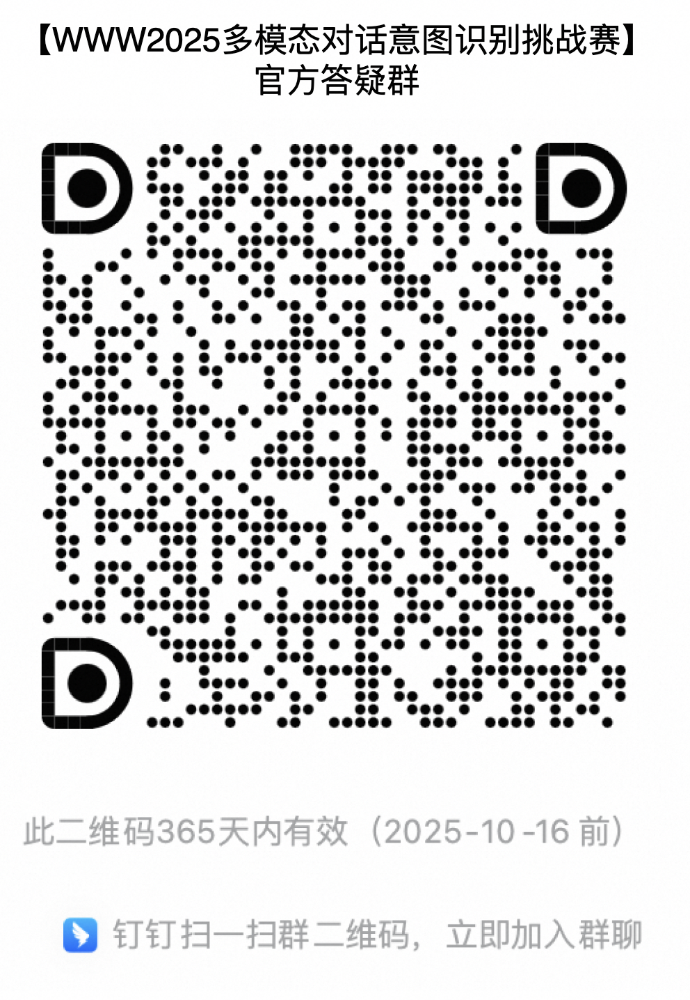

# MIRE

本项目提供了WWW2025 Multimodal Intent Recognition for Dialogue Systems的官方baseline，具体包含模型训练、评测以及转换成提交结果格式等功能。

## 如何使用

### **安装**

本项目基于开源项目的训练和推理框架，首先要**安装LLaMA Factory**，具体参考

**https://github.com/hiyouga/LLaMA-Factory**

### 训练

**Step 1:** 替换配置，

- 将下载的训练集文件`train.json`放到`LLaMA-Factory/data/mire/train.json`
- 将数据配置`mire_baseline/configs/data_info.json`替换原始LLaMA-Factory的数据配置`LLaMA-Factory/data/data_info.json`
- 将训练配置文件`mire_baseline/configs/qwen2_vl_full_sft.yaml`放到`LLaMA-Factory/examples/qwen2_vl_full_sft.yaml`

**Step 2:** 使用训练配置训练，在单机上进行指令监督微调

```
FORCE_TORCHRUN=1 llamafactory-cli train examples/qwen2_vl_full_sft.yaml
```

### 推理

**step 1:** 将推理配置`mire_baseline/configs/predict.yaml`放到`LLaMA-Factory/examples/predict.yaml`，注意要修改predict.yaml中的模型地址、测试集、推理结果保存地址等参数。

**Step 2:** 使用推理配置执行推理命令

```
llamafactory-cli train examples/predict.yaml
```

### 生成提交文件

修改`mire_baseline/convert2submit.py`中的测试文件以及推理结果文件地址后执行：

```
python mire_baseline/convert2submit.py
```

### 计算准确率（可选）

如果有标注过的测试文件以及对应的推理结果，可以计算推理的准确率，修改`mire_baseline/cal_acc.py`中的测试文件以及推理结果文件地址后执行：

```
python mire_baseline/cal_acc.py
```

本项目执行后会打印出类似：

```json
{"f1": 0.5333333333333333, "accuracy": 0.5, "precision": 0.6, "recall": 0.5}
```

其中f1为最终评测指标。

## 任务介绍：

本次比赛数据集全部为文本结合图像的分类任务，其中包含2大类：图片场景分类以及多轮对话意图分类。

### 1）图片场景分类：

图片场景分类的具体场景为用户向客服发了一张图片，需要判断这张图片属于电商场景的哪个类型。具体类型标签以及对应的描述如下：

| label                                  | 描述                                                         |
| -------------------------------------- | ------------------------------------------------------------ |
| 商品分类选项                           | 商品颜色、规格选项                                           |
| 商品头图                               | 商品首页大图                                                 |
| 商品详情页截图                         | 可能出现在商品详情页各个部分的截图                           |
| 下单过程中出现异常（显示购买失败浮窗） | 下单过程中出现异常（显示购买失败浮窗）的截图                 |
| 订单详情页面                           | 呈现出完整订单信息的订单页面                                 |
| 支付页面                               | 包含支付方式选择、支付成功的页面                             |
| ~~消费者与客服聊天页面~~                   | ~~淘宝APP中与平台小蜜/商家或其他客服的聊天页面~~                 |
| 评论区截图页面                         | 在淘宝APP内或其他APP内的评论区截图                           |
| 物流页面-物流列表页面                  | 呈现出两个以上物流信息的页面                                 |
| 物流页面-物流跟踪页面                  | 呈现出物流运输路径的页面                                     |
| 物流页面-物流异常页面                  | 包含物流异常信息的页面                                       |
| 退款页面                               | 含有退款信息的页面                                           |
| 退货页面                               | 含有退货信息的页面                                           |
| 换货页面                               | 含有换货信息的页面                                           |
| 购物车页面                             | 淘宝购物车页面的列表图或金额计算图                           |
| 店铺页面                               | 店铺首页截图                                                 |
| 活动页面                               | 活动截图                                                     |
| 优惠券领取页面                         | 店铺首页或活动页中领取优惠券的截图                           |
| 账单/账户页面                          | 包含交易明细列表、资产列表、卡券红包列表等                   |
| ~~个人信息页面~~                           | ~~与用户个人信息有关的各种页面~~                                 |
| 投诉举报页面                           | 投诉或举报页面                                               |
| 实物拍摄(含售后)                       | 用户用相机实拍的照片，包括用户售后的照片（损坏、缺失、与描述不符），或者其他用相机实拍的图片 |
| 外部APP截图                            | 各种非淘宝、菜鸟APP的截图，包括京东、拼多多、短信、手机系统截图 |
| 平台介入页面                           | 平台客服介入处理的截图                                       |
| 其他类别图片                           | 拿不准的其他图片                                             |

### 2）对话意图分类

对话意图分类的场景为通过用户与客服的对话历史以及当前用户的问题判断用户的意图，对话历史中包含至少一张用户发的图片，可能有助于意图的判断。意图标签以及对应的描述如下：

| label          | 描述                                                         |
| -------------- | ------------------------------------------------------------ |
| 反馈密封性不好 | 买家反馈商品密封性差会漏                                     |
| 是否好用       | 买家咨询商品是否好用                                         |
| 是否会生锈     | 咨询商品是否会生锈                                           |
| 排水方式       | （适用产品：洗衣机、热水器）咨询商品排水方式                 |
| 包装区别       | 咨询商品不同包装的区别                                       |
| 发货数量       | 咨询商品发货数量                                             |
| 反馈用后症状   | 买家反馈用完后引起的人体反应                                 |
| 商品材质       | 咨询商品具体材质，配件材质，填充物                           |
| 功效功能       | 咨询商品功效功能                                             |
| 是否易褪色     | 咨询商品是否易褪色                                           |
| 适用季节       | 咨询商品适用季节                                             |
| 能否调光       | 咨询商品光源/灯光/光线/亮度是否可调                          |
| 版本款型区别   | 咨询两个版本/型号/款式/类型/套装/组合等区别，不包括商品数量/重量/尺寸类区别 |
| 单品推荐       | 消费者咨询能否帮助推荐一下某类/某个商品，非sku级别           |
| 用法用量       | 咨询商品使用方法/步骤/顺序，包括但不限于用量，使用时间，使用部位 |
| 控制方式       | 咨询商品如何控制，能否可以通过手机/电脑控制                  |
| 上市时间       | 咨询商品的上市时间                                           |
| 商品规格       | 咨询商品的数量、重量、含量、容量                             |
| 信号情况       | 咨询手机使用的信号是否良好，以及信号不佳如何处理             |
| 养护方法       | 咨询商品的养护方法                                           |
| 套装推荐       | 消费者希望能推荐一些套装                                     |
| 何时上货       | 咨询补货/上货时间                                            |
| 气泡           | 咨询贴膜如何避免产生气泡及除气泡方法                         |

## 比赛规则：

- 参赛者可以从天池平台上获取比赛数据集，具体包括：
  - 1,000个标记的对话样本用于训练
  - 10,000个未标记的样本用于初赛测试
  - 在复赛中还有额外的10,000个新测试样本

- 模型参数的最大数量不得超过10B。
- 每个样本最多允许进行3次模型调用，总输出 token 的最大限制为100。

## Baseline

本项目baseline使用qwen2-vl-7b full sft的方式，baseline准确率为80.60%。具体为：

|                  | F1        | Precision | Recall |
| ---------------- | --------- | --------- | ------ |
| overall          | **0.7882** | 0.8093    | 0.787  |
| 对话意图分类任务 | 0.8648    | 0.8812    | 0.866  |
| 图片场景分类任务 | 0.7116    | 0.7373    | 0.708  |


## 官方答疑群


